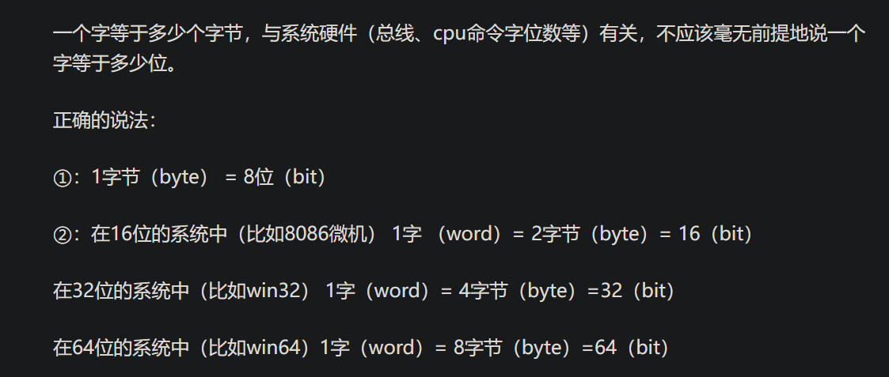

#### 02-everythingIsObject（其实还有基本类型，不过基本类型都有对应的Object）
- 对象的创建、存储、销毁
  - 存储：
    - 寄存器：Java不能直接控制
    - 堆栈：对象引用
    - 堆：对象
    - 常量：常量不能改变
    - 非RAM存储：eg：对象序列化到非RAM
    - 总结：在RAM中，创建一个对象(Student s=new Student())，s在堆栈、s指向的对象在堆
  - 基本类型：
    - 
    - | 基本类型    | 大小 | 包装器类型 |
      | ---------| ------ |---|
      | boolean  | -      |Boolean
      | char     | 16bits      |Character
      | byte     |      8bits |  Byte
      | short     |      16bits |  Short
      | int     |      32bits |  Integer
      | long     |      64bits |  Long
      | float     |      32bits |  Float
      | double     |      64bits |  Double
      | void     |      - |  Void
  - 永远不需要销毁对象：
    - 对象引用——>对象，会监听对象是否被引用，若无任何的对象引用指向，会清除堆中的对象
- 构建一个Java程序
- 注释、嵌入式文档、编码风格