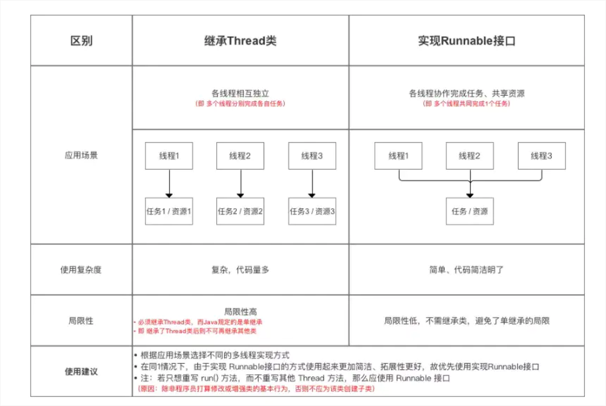

#### 21-concurrent
1. 并发的多面性
   - 有人提倡将“进程“作为唯一合法的并发方式，但遗憾的是，对进程通常有数量和开销的限制；而Java采取了更加传统的方式：在顺序性语言的基础上提供对线程的支持
   - Java的线程机制是抢占式的
2. 基本的线程机制
   - [通过实现Runnable接口创建线程](src/main/java/threadmechanism/LiftOff.java)
   - [Executor的demo](src/main/java/threadmechanism/ExecutorDemo.java)
   - [实现Callable<>接口（call()方法比Runnable的run()有返回值）创建线程任务](src/main/java/threadmechanism/CallableDemo.java)
   - 休眠：Old-style:Thread.sleep(ms:xxx)，单元为ms;JavaSE5/6-style:TimeUnit.时间单元.sleep(xxx)，自定义时间单元
   - 优先级:[线程优先级demo](src/main/java/threadmechanism/SimplePriority.java)
   - 让步:run()方法中的Thread.yield()时，建议别的“相同优先级”的其它线程运行
   - 后台线程
     - [daemon（守护进程、后台进程）的demo](src/main/java/threadmechanism/SimpleDaemon.java)
     - [DaemonThread的工厂。通过ExecutorService创建（创建线程使用“工厂”参数）和管理Thread](src/main/java/threadmechanism/DaemonThreadFactory.java)
       - 一些总结：
         1. 使用了daemon守护进程/后台进程，就不用在最后使用es.shutdown()了
         2. es.shutdown()的作用：es管理的所有子线程任务完成后尽快退出当前线程/主线程。主线程在子线程完成之前一直在运行
         3. Thread.setDaemon(true)：创建的子线程变为后台/守护进程，当前线程/主线程直接退出，不等子线程完成
     - [一些猜想以及代码验证demo](src/main/java/threadmechanism/SomeConclusion.java)
       1. 猜想1：若无Executor创建和管理子线程，又无daemon线程，就是普通子线程，main()主线程会在所有子线程执行完之后，退出 
       2. 猜想2：若有Executor创建和管理子线程，若有es(即ExecutorService).shutdown()，则main()主线程会在es中的子线程完成后，会被告知要尽快结束
                                        ；若无es.shutdown()，则main()主线程在es中的子线程完成后，不会被告知结束，过比较长的一段时间后才会被JVM给回收 
       3. 猜想3：若有daemon线程，则主线程直接退出后“主线程创建的子线程”不归主线程管理了，可能看不到子线程的运行结果（主线程可以休眠适当时间来观看子线程的运行结果） 
       （注：(1)可以人为地直接创建daemon线程，(2)也可以通过Executors.newCachedThreadPool(工厂参数)，让es自行创建daemon线程） 
       4. 注：使用了守护/后台进程（daemon），就不用使用es.shutdown了
   - 编码的变体
     - 使用extends Thread替代implements Runnable，优点：更容易；缺点：不能再extends其它类了 
     - [extends Thread、implements Runnable以及它们的各种内部类变体](src/main/java/threadmechanism/variant/VariantDemos.java)
   - 作者的术语：
     - **Runnable接口这个名字不好，作者认为Task应该是更好的名字。**
     - **“将要执行的工作”时，使用术语“任务”。只有在引用“驱动任务的具体机制”时，使用术语“线程”**
   - 加入一个线程：join()
     - [Thread的join()方法的demo](src/main/java/threadmechanism/ThreadJoinDemo.java) 注：该demo不能使用Executors，需要人为自行创建和管理才能使join()有效
   - 线程组：废弃
   - 捕获异常：skip 
3. 共享受限资源
   - 不正确地访问资源
     - 注：在Java中，递增不是原子性地操作
   - 解决共享资源竞争
     - 基本所有地并发模式在解决线程冲突时，都是采用“序列化访问共享资源”。互斥量
     - 如果失败将会发生，调用Thread.yield()是一种促使其发生的有效方式
     - Java提供了synchronized关键字
     - **控制共享资源的访问：先把共享资源包装进一个对象，然后把所有要访问这个资源的方法（除了@Override run()等）标记为synchronized**。**在对象上调用其任意synchronized方法时，此对象都会被加锁**
       - eg：某个“任务”调用了f()，对于同一个对象而言，只能等到f()调用结束后并释放锁之后，其它“任务”才能调用sync...f()、sync...g()
       - 若某个任务处于一个标记为sync的方法的调用中，那么在这个线程从该方法返回之前，其它所有要调用类中任何标记为sync方法的线程都会被阻塞
     - 注意：在使用并发时，把字段设为private是非常重要的
     - 一个任务可以多次获得对象的锁，JVM负责跟踪对象被加锁的次数
     - synchronized：对象锁；synchronized static：类锁
     - 每个访问临界共享资源的“方法”都必须被同步，否则它们就不会正确地工作
     - Brian的同步规则：如果你正在写一个变量，它可能接下来被另一个线程读取，或者正在读取一个上一次已经被另一个线程写过的变量，那么你必须使用同步，并且，读写线程都必须用相同的监视器锁同步
     - [使用synchronized的SyncDemo](getWork/JavaDemos/21-concurrent/src/main/java/limitresource/SyncDemo.java)
       - 一些总结：多个线程使用同一个“实现Runnable接口”的类对象，共同完成1个任务，资源共享；而多个线程使用 “继承Thread类”的相互独立，资源不共享。有时候需要恰当地使用休眠
     - [使用Lock的LockDemo](getWork/JavaDemos/21-concurrent/src/main/java/limitresource/LockDemo.java)
       - 一些总结：
         - lock.lock()：阻塞式；lock.tryLock()：非阻塞式，这两者需求场景不同
         - 与sync相比，Lock具有更细粒度的控制力。sync <=> Lock的lock.lock()，都是阻塞式的，而Lock的lock.tryLock()是非阻塞式的
   - 原子性与易变性
     - 除了long和double之外的所有基本类型之上的“简单操作”，当你定义long、double变量时，使用volatile关键字，就会获得原子性
     - volatile关键字：如果你将一个字段声明为volatile，那么对这个字段产生的写操作 可以被所有读操作看到。即便使用了本地缓存，也是如此。volatile字段会立即被写入主存中，而读取操作就发生在主存中
     - 若一个字段“完全”由sync方法或语句块来防护，就不必将其设置为volatile
     - 使用volatile而不是sync的“唯一安全”的情况是-类中只有一个可变的字段。再次提醒，你的第一选择应该是sync而不是volatile
     - 对大多数基本类型的读取和赋值操作被认为是安全的原子性操作。但是，当对象处于不稳定状态时，依旧有可能被读取。最明智的做法就是遵循Brian的同步规则
     - 个人总结：使用sync而不是volatile，即便是一些对基本类型的原子操作
   - 原子类
     - AtomicInteger、AtomicLong、AtomicReference等原子类，这些Atomic类被设计用来构建juc（java.utils.concurrent）包中的类。通常使用锁要更安全些
   - 临界区:[临界区的sync、Lock的demo](getWork/JavaDemos/21-concurrent/src/main/java/limitresource/CriticalSectionDemo.java)
     - **一些总结：注意demo里的对子线程的运行过程分析**
   - 在其它对象上同步
     - 通过使用同步sync块：[同步其他对象的demo](getWork/JavaDemos/21-concurrent/src/main/java/limitresource/SyncOtherObject.java)
   - 线程本地存储
     - 防止任务（Runnable）在共享资源上产生冲突的第二种方式-根除对变量的共享
     - 线程本地存储是一种自动化机制，可以为使用相同变量的每个不同线程都创建不同的存储
     - 个人感觉意义不大呀（可能水平有限）：读还行，写的话应该存在冲突吧
     - skip
   - 注意：
     - 可以为一个对象实例创建多个子线程：Account account=new Account(); 多次执行es.submit(account);
     - 也可以为单独为每个对象实例创建一个子线程：多次执行es.submit(new Entrance());
     - 需求场景不同，第一种比如在多线程访问同一个Account对象实例（有“余额”这个字段）；
     - 第二种比如在花园有多个入口对象，每个入口有自己的“进入的人数”的字段，也有所有入口的进入人数的字段。Entrance类有int number;static int total
   - 一些关于cpu、进程、线程的思考（cpu是灵魂，进程一个需要做的任务，线程是肉体（基本调度单位））：
     - 现有一个灵魂（cpu），需要做的任务是在一张纸上写作业（写作业：一个进程）。
       - 若现在创建1个肉体（即1个子线程），则完成作业花费的时间为t;
       - 若现在创建2个肉体（即2个子线程），灵魂可以在两个肉体飞速切换，切换时间几乎可以忽略不计，则完成作业花费的时间为t/2
4. 终结任务
   - [花园demo，并在最后取消task(即Runnable)](src/main/java/cancelrunnable/GardenDemo.java)
   - 线程状态：
     1. 新建（new）
     2. 就绪（Runnable）
     3. 阻塞（Blocked）
        - 进入阻塞状态：
          1. 调用sleep()使任务（Runnable）休眠
          2. 调用wait()使线程挂起，直到notify()、notifyAll()或（<=>）juc的signal()、signalAll()
          3. 任务（Runnable）等待某个输入/输出完成
          4. 任务试图获得某个对象的同步控制方法，但对象锁不可用（别的任务获取了这个锁）
     4. 死亡（Dead）
   - 中断
   - 检查中断
5. 线程之间的协作：如何使任务彼此之间可以协作，使得多个任务可以一起工作去解决某个问题。（eg：盖房子：先地基->并行地铺设钢结构、水泥部件->混凝土浇筑->...）
    - 在互斥的基础上，为任务添加了一种途径，可以将自身挂起。直至某些外部条件发生变化
    - wait()与notifyAll()
      - 调用sleep()、yield()时锁并没有被释放，调用wait()，线程的运行被挂起，对象上的锁被释放
      - wait()与sleep()的不同：在wait()期间，对象锁是释放的；通过notify()、notifyAll()或者时间参数到期，才会从wait()恢复执行
      - wait()、notify()、notifyAll()是基类Object的一部分，而不是Thread的一部分
      - 调用wait()、notify()、notifyAll()之前必须拥有对象的锁
      - [打蜡、擦拭 Car的demo，有一个对象锁-car](src/main/java/threadcooperation/oneobjectlock/WaxOMatic1.java)
        - 一些总结：**while循环包围wait()的重要性**：其本质就是要检查所感兴趣的特定条件，并在条件不满足的情况下返回到wait()中。惯用的方法就是使用while来编写这种代码
        - 注意，在调用wait()时考虑外面包一层while()
    - notify()与notifyAll()
      - 当notifyAll()因某个特定锁而被调用时，只有等待这个锁的任务才会被唤醒
      - [打蜡、擦拭 Car的demo，有2个对象锁-car1、car2](src/main/java/threadcooperation/twoobjectlock/WaxOMatic2.java)
    - 生产者与消费者
      - [一个餐馆，只有一个厨师和一个服务员，且餐馆的窗口只能放一个Meal](src/main/java/threadcooperation/Restaurant.java)
        - ```
          可以这样理解：
          一个餐馆，只有一个厨师和一个服务员，且餐馆的窗口只能放下一个Meal。
          厨师等待（this.wait()），直到窗口没餐（被服务员notifyAll()），然后去做饭，通知服务员拿餐（即restaurant.waitPerson.notifyAll()）
          服务员等待（this.wait()），直到窗口有餐（被厨师notifyAll()），然后去窗口拿餐，通知厨师做饭（即restaurant.chef.notifyAll()）
          restaurant.waitPerson.notifyAll()的同步块：sync...(restaurant.waitPerson)
          restaurant.chef.notifyAll()的同步块：sync...(restaurant.chef)
          this.wait()的同步块：sync...(this)
          总结：“谁”等待/通知“谁”，sync...(“谁”) 即（“谁”等待/通知“谁”，就给“谁”上锁）
          ```
      - [一个餐馆，只有一个厨师和一个服务员，且餐馆的窗口只能放下一个Meal (用Lock和Condition替代sync同步锁)](src/main/java/threadcooperation2/Restaurant.java)
        - ```
          总结和上面的一样：“谁”等待/通知“谁”，就给“谁”上锁
          ```
      - demo的不足：实际场景是一个餐馆，多个厨师、多个服务员，餐馆的窗口可以放多个Meal  --->  需要使用队列（也就是下面这个“生产者-消费者 与 队列”）
    - 生产者-消费者 与 队列
      - [BlockingQueue（不用使用显式的同步）的demo](src/main/java/syncqueue/TestBlockingQueues.java)
      - [吐司制作以及加工流程（该示例没有任何显式的同步（即Lock对象/sync...关键字的同步），同步是由队列管理，也没有显式的wait()、notifyAll()）](src/main/java/syncqueue/ToastOMatic.java)
    - 任务（Runnable）间使用管道进行输入/输出：通过PipedWriter类（允许任务向管道写）、PipedReader类（允许不同任务从同一管道中读取）。管道基本是一个阻塞队列
      - [Piped（管道）基本是一个阻塞队列（同步队列），PipedReader、PipedWriter测试](src/main/java/syncqueue/PipedIO.java)
6. 死锁（Java对死锁没有提供语言层面上的支持，通过仔细地设计程序来避免死锁，这取决于你自己）
    - [哲学家就餐问题的死锁修复版本](src/main/java/deadlock/FixedDiningPhilosophers.java)
    - 死锁的发生条件：
      1. 互斥条件
      2. 至少有一个任务必须持有一个资源，且正在等待获取 另一个被别的任务持有的资源
      3. 资源不能被任务抢占
      4. 必须有循环等待（在demo中，每个哲学家都试图先得到右边的筷子，然后左边的筷子。当每个哲学家都占据右手边筷子，就会出现无限等待左边筷子）
    - 防止死锁：通过破坏上面的任意一个条件即可。在程序中，防止死锁最容易的是破坏第4个条件
7. 新类库中的构件
   - skip
8. 仿真
   - [银行出纳员仿真](src/main/java/emulation/BankTellerSimulation.java)
   - [饭店仿真]()：skip
   - [分发工作]()：skip
9. 性能调优
   - skip
10. 活动对象
    - skip
11. 补充：
    - 网上很多博客所认为的：
      - 
    - 关于Thread与Runnable的区别：网上很多人都说Runnable便于资源共享，在《仿真-银行出纳员仿真》的demo中，我不禁发出了疑问，于是写了个demo
        - demo的结论：Thread、Runnable的资源共享在于“字段是对象而不是基本类型，该字段就能实现资源共享“ ----> 
          - 对于implements Runnable或extends Thread的类，在多线程中/非多线程时，对象字段都是共享资源，而基本类型字段则不是（原因：对象字段是引用值，指向 堆） 
          - 和implements Runnable 还是 extends Thread，没关系！！！
        - [demo验证:Runnable、Thread的资源共享的真正含义](src/main/java/resourcesharingtest/ResourceSharingTester.java)